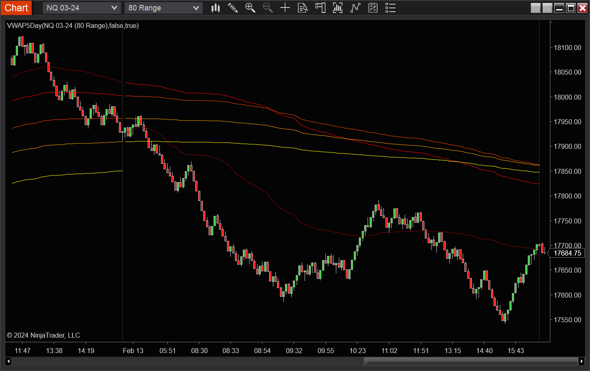
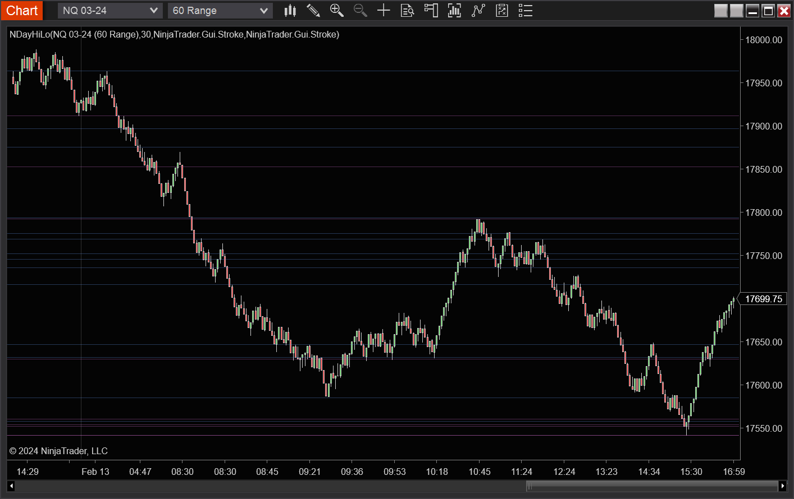

# Ninjascript Indicators
Indicators written in Ninjascript

## General Warning
Trading financial instruments, due to its appearance of "easy money", attracts certain unscrupulous types:
 
 * Beware of anyone who is trying to sell you their "magic indicators".
 * Beware of any "financial gurus" who never disclose their full P&L statisitcs. 
 * Beware of anyone showing only their winning trades as a "proof" of their technique.

Simply put: **"Beware of Evil Workers!"**

## Disclosures
The indocators presented here are provided solely for informational purposes.

This publication does not constitute a recommendation for the NinjaTrader trading platform, nor a recommendation for the NinjaTrader brokerage services or any other third party services provided alongside of them. This is also not an encouragement to engage in any kind of trading, whether involving futures or any other financial instuments.

## List of Indicators

If you want to use these indicators in your NT environment, open an editor window, open a new indicator, copy/paste the file contents and then compile (F5) the code.

Note: I put all my cutom files are inside a NT subfolder titled `MyIndicators`, to keep them separate for NT's own built-in indi's. Change the namespace in line 25 of each file to match the name of your desired subfolder.

### Moving Average Serpent / Snake
The idea is to remove some of the clutter that comes with having too many moving averages criss-crossing the chart. This particular example implements for pairs of EMA's. You can repurpose it to use any other type of indicator, or even pairs consisting of different indicator types (e.g. EMA vs SMA).

Note: If you don't like the indicator name wasting your chart real estate, set the `label` property to an empty string in the indicator menu.

### Multi-day VWAP
The Volume-Weighted Average Price for multiple previous days -- here implemented for five.

The general idea is to keep track of n-day cumulative volume as well as the "typical volume", i.e. volume * typical-price. At the beginning of the session a rotation is performed. 

Note 1: The data for the past 5 days need to be loaded in the chart.

Note 2: The option for making the first point of the session invisible is to avoid spurious lines connecting a day's k-th vwap to the previous day's (k-1)th vwap curve. Using this option is unnecessary if a discrete plot style, say a hash plot, is used instead of line plots.

There is quite a bit of code repetition, hence ample room for refactoring as well as generalizations for N days.

### N-day High-Low
A simple plotting of the highs and lows of the previous N days. Low opacity is especially helpful to notice overlapping lines.

